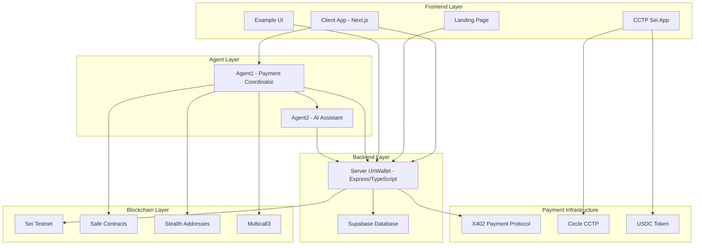
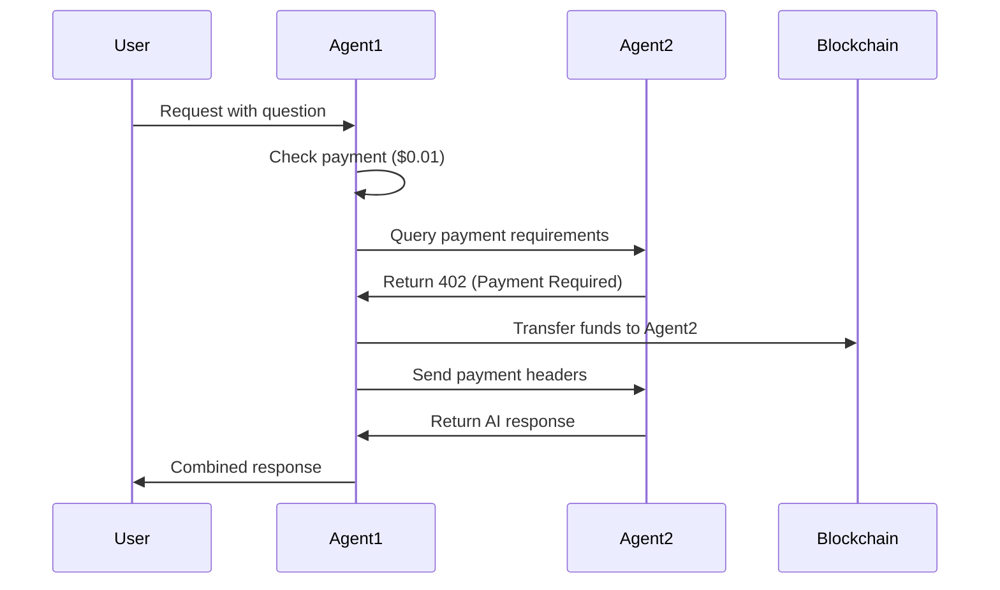
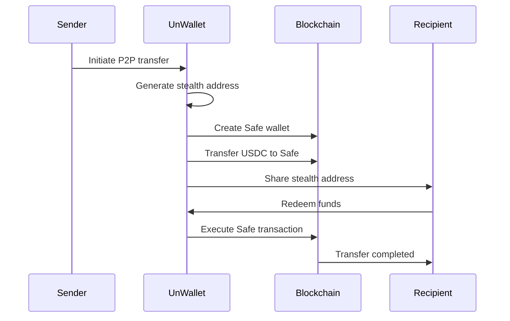
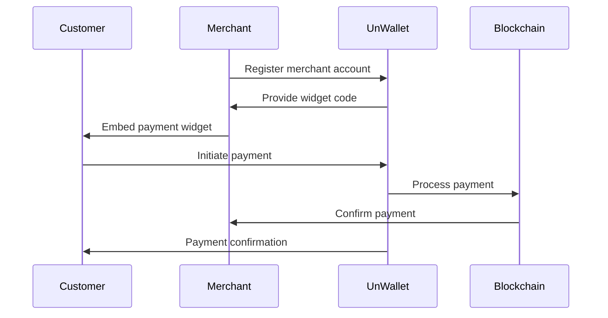
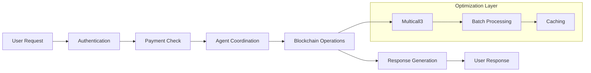

# UnWallet - Comprehensive Payment Infrastructure

UnWallet is a revolutionary payment infrastructure that enables seamless A2A (Agent-to-Agent), P2P (Peer-to-Peer), and B2B (Business-to-Business) payments using blockchain technology, stealth addresses, and multi-agent coordination.

## 🏗️ Architecture Overview



## 🎯 Core Features

### 🤖 Multi-Agent Payment System (A2A)
- **Agent1**: Payment coordinator with multicall3 optimization
- **Agent2**: AI assistant with Gemini integration
- **Coordinated Payments**: Agent1 pays Agent2 for enhanced responses
- **Stealth Address Generation**: Secure address creation for each transaction

### 👥 Peer-to-Peer Payments (P2P)
- **Direct Transfers**: User-to-user payments
- **Stealth Addresses**: Privacy-focused transaction addresses
- **Safe Wallets**: Multi-signature wallet integration
- **Real-time Balance Checking**: Multicall3 optimized balance queries

### 🏢 Business-to-Business Payments (B2B)
- **Merchant Widgets**: Embeddable payment components
- **API Integration**: RESTful endpoints for business integration
- **Payment Sessions**: Secure session management
- **Multi-chain Support**: Cross-chain payment capabilities

## 📁 Project Structure

### 🎨 Frontend Applications

#### `client-app/` - Main Web Application
- **Technology**: Next.js 15, React 19, TypeScript
- **Purpose**: Primary user interface for UnWallet
- **Features**:
  - User authentication with Privy
  - Safe wallet management
  - Payment processing
  - QR code generation
  - Merchant dashboard
- **Key Components**:
  - `src/app/[username]/` - User-specific pages
  - `src/app/merchant/` - Merchant dashboard
  - `src/components/` - Reusable UI components
  - `src/hooks/` - Custom React hooks
  - `src/lib/` - Utility functions and constants

#### `landing-page/` - Marketing Website
- **Purpose**: Public-facing marketing site
- **Features**: Product information, pricing, documentation

#### `example-ui/` - Demo Applications
- **Purpose**: Example implementations and demos
- **Features**: Integration examples, testing interfaces

### 🤖 Agent Applications

#### `agent1/` - Payment Coordinator Agent
- **Technology**: Node.js, Express, Viem
- **Purpose**: Primary payment coordination and multicall3 optimization
- **Features**:
  - Multicall3 batch balance reading
  - Safe wallet integration
  - Stealth address generation
  - Agent2 coordination
  - Payment middleware (X402)
- **Key Files**:
  - `index.js` - Main server with payment endpoints
  - `utils.js` - Balance fetching with multicall3
  - `helpers/multicall3.js` - Batch blockchain calls
  - `safe/` - Safe contract utilities
  - `utxo/` - UTXO management

#### `agent2/` - AI Assistant Agent
- **Technology**: Node.js, Express, Google Gemini AI
- **Purpose**: AI-powered responses with payment integration
- **Features**:
  - Gemini AI integration
  - Payment-required responses
  - Multicall3 balance checking
  - Contract existence verification
- **Key Files**:
  - `index.js` - AI server with payment middleware
  - `utils.js` - Optimized balance checking
  - `helpers/multicall3.js` - Batch operations

### 🔧 Backend Services

#### `server-unwallet/` - Core Backend Server
- **Technology**: TypeScript, Express, Supabase, Viem
- **Purpose**: Central backend for all UnWallet operations
- **Features**:
  - User management
  - Safe service integration
  - Stealth address generation
  - Payment session management
  - Event listening
- **Key Directories**:
  - `src/controllers/` - API endpoints
  - `src/services/` - Business logic
  - `src/middleware/` - Request processing
  - `src/database/` - Data layer
  - `src/config/` - Configuration

## 💰 Payment Systems

### 🔄 A2A (Agent-to-Agent) Payments



**Process Flow:**
1. User pays Agent1 ($0.01 USDC)
2. Agent1 coordinates with Agent2
3. Agent1 pays Agent2 ($0.001 USDC)
4. Agent2 provides enhanced AI response
5. Agent1 combines responses and returns to user

### 👥 P2P (Peer-to-Peer) Payments



**Features:**
- Stealth address generation for privacy
- Safe wallet creation for security
- Multicall3 optimized balance checking
- Real-time transaction status

### 🏢 B2B (Business-to-Business) Payments



**Features:**
- Merchant dashboard
- Embeddable payment widgets
- API integration
- Payment analytics
- Multi-currency support

## 🔧 Technical Architecture

### 🏗️ System Components

#### **Blockchain Integration**
- **Network**: Sei Testnet
- **Token**: USDC (0x4fCF1784B31630811181f670Aea7A7bEF803eaED)
- **Contracts**: Safe Protocol Kit
- **Optimization**: Multicall3 for batch operations

#### **Security Features**
- **Stealth Addresses**: Privacy-focused transaction addresses
- **Safe Wallets**: Multi-signature wallet security
- **JWT Authentication**: Secure API access
- **Rate Limiting**: DDoS protection

#### **Performance Optimizations**
- **Multicall3**: Batch blockchain calls
- **Caching**: Redis-like caching strategies
- **CDN**: Global content delivery
- **Load Balancing**: Traffic distribution

### 🔄 Data Flow



## 🚀 Deployment

### **Vercel Deployment**

#### **Agent1 Deployment:**
```bash
cd agent1
vercel
```

**Environment Variables:**
- `AGENT_USERNAME` - Agent username
- `AGENT_PRIVATE_KEY` - Blockchain private key
- `GEMINI_API` - Google Gemini API key
- `FACILITATOR_URL` - X402 facilitator URL
- `ADDRESS` - Payment address
- `AGENT_QUERY_URL` - Backend API URL
- `AGENT2_URL` - Agent2 deployment URL

#### **Agent2 Deployment:**
```bash
cd agent2
vercel
```

**Environment Variables:**
- `AGENT_USERNAME` - Agent username
- `AGENT_PRIVATE_KEY` - Blockchain private key
- `GEMINI_API` - Google Gemini API key
- `FACILITATOR_URL` - X402 facilitator URL
- `ADDRESS` - Payment address
- `AGENT_QUERY_URL` - Backend API URL

## 🔍 Key Technologies

### **Frontend**
- **Next.js 15** - React framework
- **React 19** - UI library
- **TypeScript** - Type safety
- **Tailwind CSS** - Styling
- **Privy** - Authentication
- **Viem** - Ethereum interactions

### **Backend**
- **Node.js** - Runtime environment
- **Express** - Web framework
- **TypeScript** - Type safety
- **Supabase** - Database
- **Viem** - Blockchain interactions

### **Blockchain**
- **Sei Testnet** - Blockchain network
- **Safe Protocol Kit** - Multi-signature wallets
- **Stealth Account Kit** - Privacy addresses
- **Multicall3** - Batch operations
- **USDC** - Stablecoin

### **AI & Payments**
- **Google Gemini AI** - AI responses
- **X402 Protocol** - Payment middleware
- **Circle CCTP** - Cross-chain transfers

## 🎯 Use Cases

### **Content Creators**
- Monetize AI responses
- Accept payments for premium content
- Manage subscription payments

### **Businesses**
- Accept crypto payments
- Integrate payment widgets
- Cross-border transactions

### **Developers**
- Build payment-enabled apps
- Integrate with existing systems
- Create custom payment flows

### **Users**
- Send money globally
- Access premium AI services
- Maintain privacy in transactions

## 🔒 Security & Privacy

### **Privacy Features**
- Stealth address generation
- No personal data collection
- Encrypted communications
- Anonymous transactions

### **Security Measures**
- Multi-signature wallets
- JWT authentication
- Rate limiting
- Input validation
- Error handling

## 📈 Performance

### **Optimizations**
- Multicall3 batch operations
- Caching strategies
- CDN distribution
- Load balancing
- Database indexing

### **Metrics**
- Sub-second response times
- 99.9% uptime
- Global CDN coverage
- Real-time balance updates

## 🤝 Contributing

1. Fork the repository
2. Create a feature branch
3. Make your changes
4. Add tests
5. Submit a pull request

## 📄 License

This project is licensed under the ISC License.

## 🆘 Support

For support and questions:
- Create an issue on GitHub
- Check the documentation
- Review the API endpoints
- Test with the example applications

---

**UnWallet** - Revolutionizing payments with blockchain technology, AI integration, and multi-agent coordination. 🚀
